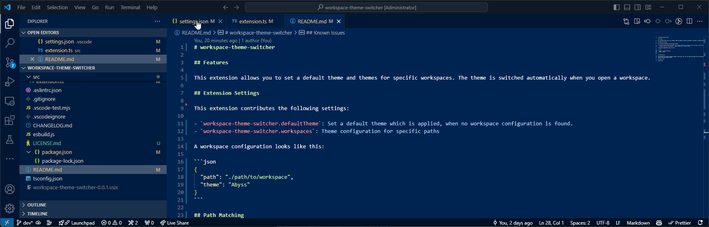

# Workspace Theme Switcher



## Features

This extension allows you to set a default theme and themes for specific workspaces. The theme is switched automatically when you open a workspace.

## Extension Settings

This extension contributes the following settings:

- `workspace-theme-switcher.defaultTheme`: Set a default theme which is applied, when no workspace configuration is found.
- `workspace-theme-switcher.workspaces`: Theme configuration for specific paths

A workspace configuration looks like this:

```json
{
  "path": "./path/to/workspace",
  "theme": "Abyss"
}
```

## Path Matching

The workspaces are sorted ascending by length of their path. The first file path which begins with the workspace path is used. If no workspace path matches, the default theme is used.

## Known Issues

Coming soon.
